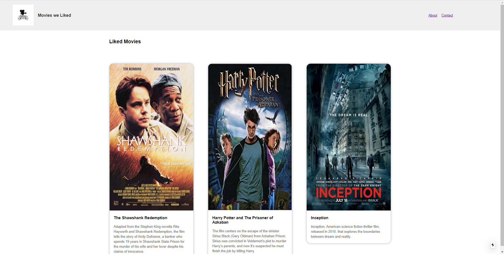
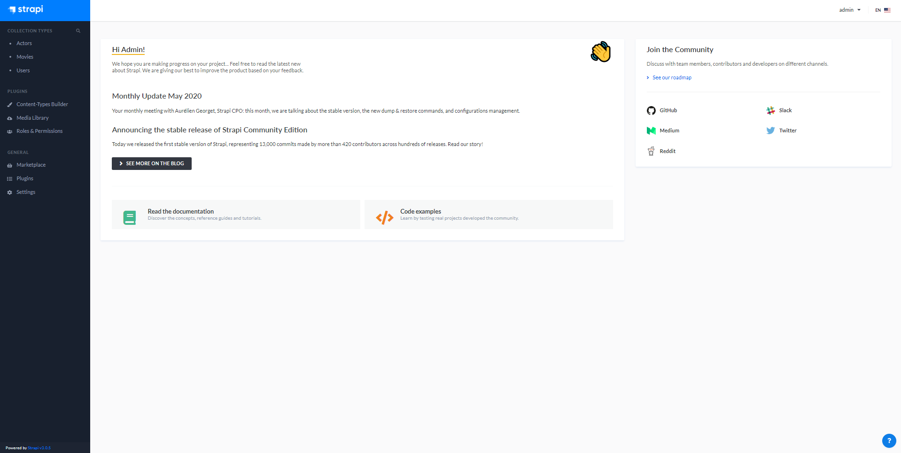

# NextJs Tutorial with Strapi

ReactJs ile yazılmış bir framework olan NextJs ve Headless CMS olan Strapi'yi denemek için yazdığım movies uygulaması.

### npm install

İle package.json dosyasında bulunan development ve project dependencies'leri indirin.

Kurulum tamamlandıktan sonra,

### npm run dev

İle uygulamayı development modunda çalıştırın. Uygulamaya browser'da http://localhost:3000 yazarak ulaşabilirsiniz.

### npm run start

Strapi için my-project klasörüne girdikten sonra npm run start demeniz gerekli. Bu http://localhost:1337 'de çalışan
api'mizi temsil ediyor.

### Ekran Görüntüleri

